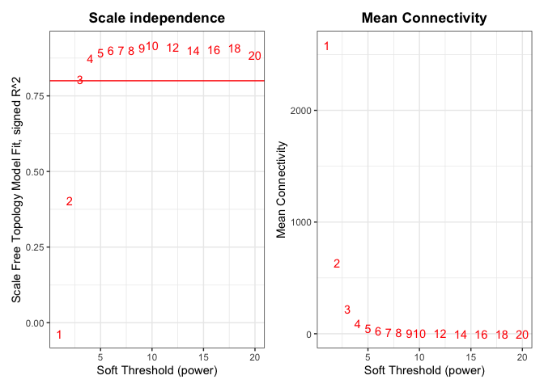
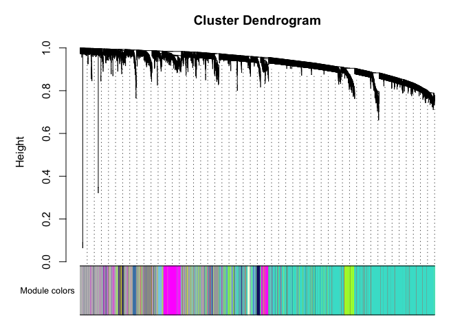
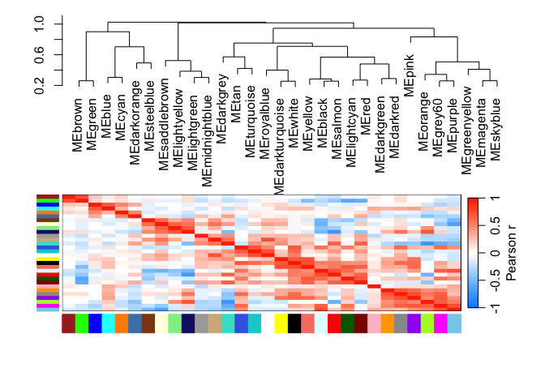
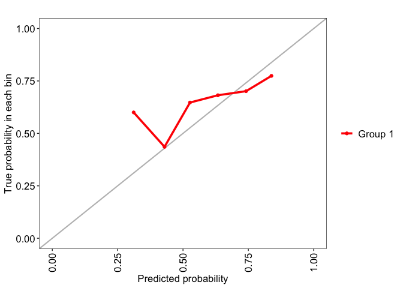
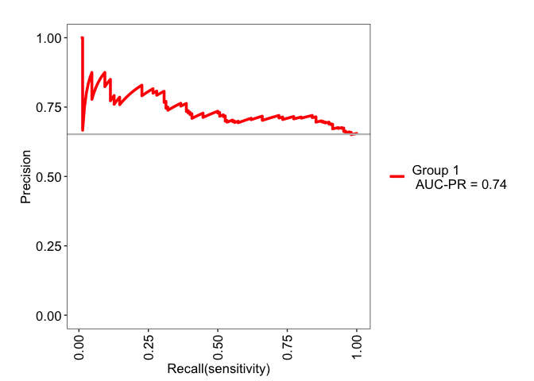
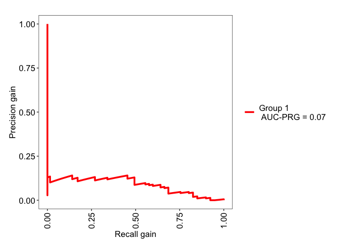
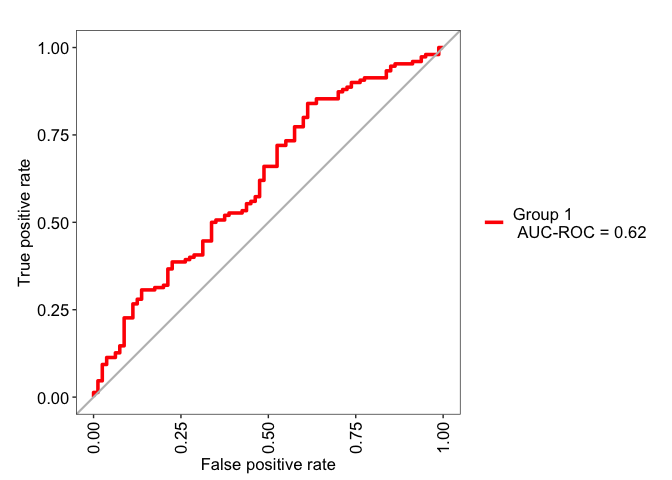
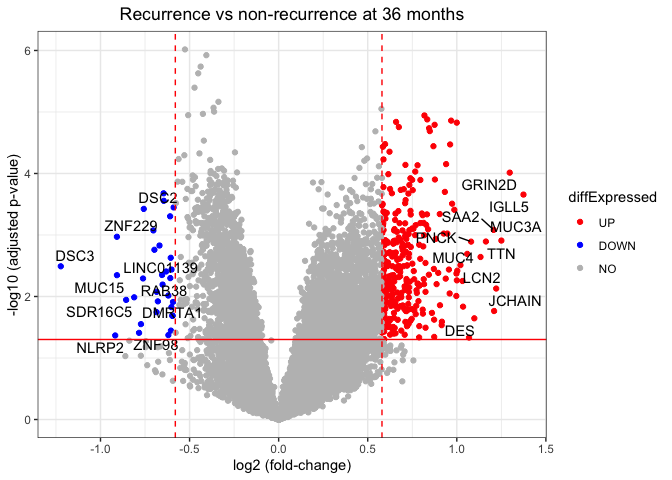

02-Feature discovery
================

# Libraries

``` r
# Data cleaning
library(tidyverse)
```

    ## Warning: package 'ggplot2' was built under R version 4.5.2

    ## Warning: package 'tibble' was built under R version 4.5.2

    ## Warning: package 'tidyr' was built under R version 4.5.2

    ## Warning: package 'purrr' was built under R version 4.5.2

    ## ── Attaching core tidyverse packages ──────────────────────── tidyverse 2.0.0 ──
    ## ✔ dplyr     1.1.4     ✔ readr     2.1.5
    ## ✔ forcats   1.0.1     ✔ stringr   1.6.0
    ## ✔ ggplot2   4.0.1     ✔ tibble    3.3.1
    ## ✔ lubridate 1.9.4     ✔ tidyr     1.3.2
    ## ✔ purrr     1.2.1     
    ## ── Conflicts ────────────────────────────────────────── tidyverse_conflicts() ──
    ## ✖ dplyr::filter() masks stats::filter()
    ## ✖ dplyr::lag()    masks stats::lag()
    ## ℹ Use the conflicted package (<http://conflicted.r-lib.org/>) to force all conflicts to become errors

``` r
# Parallelization
library(doParallel)
```

    ## Loading required package: foreach
    ## 
    ## Attaching package: 'foreach'
    ## 
    ## The following objects are masked from 'package:purrr':
    ## 
    ##     accumulate, when
    ## 
    ## Loading required package: iterators
    ## Loading required package: parallel

``` r
# Graphing packages
library(ggfortify)
library(ggplot2)
library(patchwork)
library(shapviz)
library(ComplexHeatmap)
```

    ## Loading required package: grid
    ## ========================================
    ## ComplexHeatmap version 2.24.1
    ## Bioconductor page: http://bioconductor.org/packages/ComplexHeatmap/
    ## Github page: https://github.com/jokergoo/ComplexHeatmap
    ## Documentation: http://jokergoo.github.io/ComplexHeatmap-reference
    ## 
    ## If you use it in published research, please cite either one:
    ## - Gu, Z. Complex Heatmap Visualization. iMeta 2022.
    ## - Gu, Z. Complex heatmaps reveal patterns and correlations in multidimensional 
    ##     genomic data. Bioinformatics 2016.
    ## 
    ## 
    ## The new InteractiveComplexHeatmap package can directly export static 
    ## complex heatmaps into an interactive Shiny app with zero effort. Have a try!
    ## 
    ## This message can be suppressed by:
    ##   suppressPackageStartupMessages(library(ComplexHeatmap))
    ## ========================================

``` r
# ML packages
library(survival)
library(caret)
```

    ## Loading required package: lattice
    ## 
    ## Attaching package: 'caret'
    ## 
    ## The following object is masked from 'package:survival':
    ## 
    ##     cluster
    ## 
    ## The following object is masked from 'package:purrr':
    ## 
    ##     lift

``` r
# Model Evaluation
library(MLeval)
library(fastshap)
```

    ## 
    ## Attaching package: 'fastshap'
    ## 
    ## The following object is masked from 'package:dplyr':
    ## 
    ##     explain

``` r
library(PRROC)
```

    ## Loading required package: rlang

    ## Warning: package 'rlang' was built under R version 4.5.2

    ## 
    ## Attaching package: 'rlang'
    ## 
    ## The following objects are masked from 'package:purrr':
    ## 
    ##     flatten, flatten_chr, flatten_dbl, flatten_int, flatten_lgl,
    ##     flatten_raw, invoke, splice

``` r
# DimReduction/Feature selection
library(FactoMineR)
library(factoextra)
```

    ## Welcome! Want to learn more? See two factoextra-related books at https://goo.gl/ve3WBa

``` r
library(WGCNA)
```

    ## Loading required package: dynamicTreeCut
    ## Loading required package: fastcluster
    ## 
    ## Attaching package: 'fastcluster'
    ## 
    ## The following object is masked from 'package:stats':
    ## 
    ##     hclust
    ## 
    ## 
    ## 
    ## Attaching package: 'WGCNA'
    ## 
    ## The following object is masked from 'package:stats':
    ## 
    ##     cor

# Functions

``` r
pfun <- function(object, newdata) {
  predict(object, data = newdata)$predictions[, "Yes"]
}

prep_new_data <- function(gene_expr) {
  # indep_scale_gene_expr <- scale(gene_expr)
  gene_expr <- as.data.frame(t(gene_expr))
  frozen_mean_sd <- read.csv("./model/final_model_mean_sd.csv", row.names = 1) %>%
    t() %>%
    as.data.frame()
  gene_expr <- gene_expr[, colnames(frozen_mean_sd)]
  # scaled_gene_expr <- scale(gene_expr,
  #                           center = frozen_mean_sd['mean',],
  #                           scale = frozen_mean_sd['sd', ]) %>%
  #   as.data.frame()
  return(gene_expr)
}
```

``` r
plot_conf_mat <- function(test_pred, test_obs) {
  cm <- caret::confusionMatrix(test_pred, as.factor(test_obs))
  cm.tbl <- cm$table %>%
    as.tibble()
    
  p1 <- ggplot(cm.tbl, aes(fill = n, x = Reference, y = fct_rev(Prediction))) + 
    geom_tile() + 
    geom_text(aes(label = n)) + 
    scale_fill_gradient(low = 'grey90', high = 'salmon', name = "n_samples") +
    scale_x_discrete(expand = expansion(add = 0), name = "Truth") +
    scale_y_discrete(expand = expansion(add = 0), name = "Prediction") +
    theme_classic()
  return(p1)
}
```

``` r
# Built a function for this

## normDf should be genes (row names) x samples. Should be normalized, non-logged is fine, just use log = TRUE
## metaDf should have samples x data where row names are sampleIDs corresponding to the normDf column data
## colour.opt: str | column in metaDf to use for colouring the points
## log: bool | whether to log2(x+1) counts or not
## axes: numeric | vector of length 2 for the PCs to plot in x,y axes respectively
## label_samples: bool | whether or not to add text labels to the samples
## title: str | plot title
## return_data: bool | if TRUE, will return the PCA object from FactoMineR instead of a plot (default: FALSE)
PCA.plot <- function(normDf, 
                     metaDf,
                     colour.opt = NULL,
                     log = FALSE,
                     axes = 1:2,
                     label_samples = TRUE,
                     title = "PCA Score Plot",
                     return_data = FALSE
                     ) {
  if (log == TRUE) {
    mtx <- t(log2(normDf + 1)) %>% as.data.frame()
  } else {
    mtx <- t(normDf) %>% as.data.frame()
  }
  
  # Initial PCA
  res.pca <- PCA(mtx, scale.unit = TRUE, graph = FALSE)

  # Number of components to use
  nComp <- data.frame(res.pca$eig) %>% 
    filter(cumulative.percentage.of.variance < 95) %>% 
    nrow()

  # redo PCA with nComp
  res.pca <- PCA(mtx, ncp = nComp, graph = FALSE)

  # standard to view just the first 2 axes (more just to see whether the experimental design separates)
  score.df <- facto_summarize(res.pca,'ind', axes = axes)
  score.df <- merge(score.df, metaDf, by = 0)

  # pct variances
  comp.axes <- paste('comp', axes, sep = " ")
  dim.axes <- paste('Dim', axes, sep = ".")
  dim.x <- res.pca$eig[comp.axes[1], 'percentage of variance']
  dim.y <- res.pca$eig[comp.axes[2], 'percentage of variance']
  
  if (!is.null(colour.opt)) {
      p1 <- ggplot(score.df, 
                   aes(x = .data[[dim.axes[1]]], 
                       y = .data[[dim.axes[2]]], 
                       col = .data[[colour.opt]])) +
      geom_point(size = 3) +
      geom_hline(yintercept = 0, linetype = 'dashed') +
      geom_vline(xintercept = 0, linetype = 'dashed') +
      labs(title = title,
           x = sprintf("Dim %s (%#.2f%%)", axes[1], dim.x), 
           y = sprintf("Dim %s (%#.2f%%)", axes[2], dim.y)) +
      theme_bw() +
      theme(plot.title = element_text(hjust=0.5))
    } else {
      p1 <- ggplot(score.df, 
                   aes(x = .data[[dim.axes[1]]], 
                       y = .data[[dim.axes[2]]])) +
      geom_point(size = 3) +
      geom_hline(yintercept = 0, linetype = 'dashed') +
      geom_vline(xintercept = 0, linetype = 'dashed') +
      labs(title = title,
           x = sprintf("Dim %s (%#.2f%%)", axes[1], dim.x), 
           y = sprintf("Dim %s (%#.2f%%)", axes[2], dim.y)) +
      theme_bw() +
      theme(plot.title = element_text(hjust=0.5))
    }
  
  if (label_samples == TRUE) {
    p1 <- p1 +
      ggrepel::geom_text_repel(aes(label = name), size= 3)
  }
  if (return_data) {
    return(res.pca)
  } else {
    return(p1)
  }
}
```

``` r
wgcna_threshold_plot <- function(sft, yintercept = 0.6) {
  require("patchwork")
  scale.ind <- ggplot(sft$fitIndices) +
    geom_text(aes(x = Power, y = -sign(slope)*SFT.R.sq, label = Power), color = 'red') +
    geom_hline(yintercept = yintercept, color = "red") +
    labs(x = "Soft Threshold (power)",
         y = "Scale Free Topology Model Fit, signed R^2",
         title = "Scale independence") +
    theme_bw() +
    theme(plot.title = element_text(hjust = 0.5, face = "bold"))
  
  mean.k <- ggplot(sft$fitIndices,) +
  geom_text(aes(x = Power, y = mean.k., label = Power), color = "red") +
  labs(x = "Soft Threshold (power)",
       y = "Mean Connectivity",
       title = "Mean Connectivity") +
  theme_bw() +
  theme(plot.title = element_text(hjust = 0.5, face = "bold"))
  
  pwPlot <- scale.ind + mean.k + plot_layout(ncol = 2)
  return(pwPlot)
}
```

``` r
annotate.genes <- function(geneList,
                           fields = c('symbol', 'name', 'summary')) {
  # See http://mygene.info/metadata/fields or https://docs.mygene.info/en/latest/doc/data.html for details on other fields available
  
  # 1. Convert gene symbols to entrez ID
  mapped <- clusterProfiler::bitr(geneList,
                                  fromType = "SYMBOL",
                                  toType = "ENTREZID",
                                  OrgDb = "org.Hs.eg.db",
                                  drop = TRUE)$ENTREZID
  # 2. query the mygene api
  description <- mygene::getGenes(mapped, fields = fields) %>% as.data.frame()
  
  # 3. report those with no mapped genes as NOT FOUND
  notFound <- setdiff(geneList, description$symbol)
  
  description <- description %>% add_row(symbol = notFound)
  return(description)
}
```

``` r
# Accounts for if the DE result table is from seurat's FindAllMarkers or not
volcano.plot <- function(results_lfc,
                         FDRthreshold = 0.05,
                         logFCthreshold = 2,
                         padj_name = 'padj',
                         log2FC_name = 'log2FoldChange',
                         title = "Volcano Plot",
                         label_top_diff = TRUE,
                         returnData = FALSE,
                         max_overlaps = 20,
                         seu_DE = FALSE
                         ){
  res.lfc.df <- data.frame(results_lfc) %>%
    mutate(diffExpressed = case_when(.data[[padj_name]] < FDRthreshold & 
                                       .data[[log2FC_name]] > logFCthreshold ~ "UP",
                                     .data[[padj_name]] < FDRthreshold & 
                                       .data[[log2FC_name]] < -logFCthreshold ~ "DOWN",
                                     .default = "NO"
    ),
    neglogpadj = -log10(.data[[padj_name]]))
  
  if (!seu_DE) {
    res.lfc.df <- mutate(res.lfc.df, 
                       diffExpressed = factor(diffExpressed, levels = c("UP", "DOWN", "NO")),
                       label = ifelse(diffExpressed != "NO", rownames(res.lfc.df), NA))
  } else {
    res.lfc.df <- mutate(res.lfc.df, 
                       diffExpressed = factor(diffExpressed, levels = c("UP", "DOWN", "NO")),
                       label = ifelse(diffExpressed != "NO", gene, NA))
  }
  
  
  diff.up <- res.lfc.df %>% 
    filter(diffExpressed == "UP") %>% 
    arrange(desc(.data[[log2FC_name]])) %>% 
    head(10)
  
  diff.down <- res.lfc.df %>% 
    filter(diffExpressed == "DOWN") %>% 
    arrange(.data[[log2FC_name]]) %>% 
    head(10)
  
  combined.diff.label <- bind_rows(diff.up, diff.down)
  res.lfc.df <- res.lfc.df %>% mutate(label = case_when(label %in% 
                                                          combined.diff.label$label ~ label,
                                                        .default = NA))
  res.lfc.df <- res.lfc.df %>% complete(diffExpressed)
  
  if (label_top_diff) {
    p1 <- ggplot(data = res.lfc.df,
                 aes(x = .data[[log2FC_name]], y = neglogpadj, color=diffExpressed, label = label)) +
      geom_point() +
      ggrepel::geom_text_repel(colour = 'black', max.overlaps = max_overlaps) +
      geom_vline(xintercept=c(-logFCthreshold, logFCthreshold),
                 color="red",
                 linetype = 'dashed') +
      geom_hline(yintercept=-log10(FDRthreshold), color="red") +
      scale_color_manual(values=c(DOWN = "blue", NO = "grey", UP = "red"), drop = FALSE) +
      labs(title = title,
           x = "log2 (fold-change)",
           y = "-log10 (adjusted p-value)") +
      scale_y_continuous(oob = scales::squish_infinite) +
      theme_bw() +
      theme(plot.title = element_text(hjust=0.5))
  } else {
    p1 <- ggplot(data = res.lfc.df,
                 aes(x = .data[[log2FC_name]], y = neglogpadj, color=diffExpressed)) +
      geom_point() +
      geom_vline(xintercept=c(-logFCthreshold, logFCthreshold),
                 color="red",
                 linetype = 'dashed') +
      geom_hline(yintercept=-log10(FDRthreshold), color="red") +
      scale_color_manual(values=c(DOWN = "blue", NO = "grey", UP = "red"), drop = FALSE) +
      labs(title = title,
           x = "log2 (fold-change)",
           y = "-log10 (adjusted p-value)") +
      scale_y_continuous(oob = scales::squish_infinite) +
      theme_bw() +
      theme(plot.title = element_text(hjust=0.5))
  }
  
  if (returnData) {
    return(res.lfc.df)
  } else {
    return(p1)
  }
}
```

# Read Files

``` r
uromol.clin <- readRDS("./data_cleaned/clinical/uromol_clinical_data.rds")
uromol.expr <- readRDS('./data_cleaned/expression/uromol_expression.rds')
```

# Train-test split

``` r
set.seed(1243)
idx <- caret::createDataPartition(
  uromol.clin$recurrence_at_36mths,
  p = 0.8,
  list = FALSE
)

uromol.clin.train <- uromol.clin[idx, c(1:6, 12)]
uromol.expr.train <- uromol.expr[idx,]

set.seed(1243)
## Fix the cv indices because we'll reuse them for RNAseq cv
cv_idx <- caret::createFolds(
  uromol.clin.train$recurrence_at_36mths,
  k = 10,
  returnTrain = TRUE
)

ctrl <- trainControl(
  method = "cv",
  index = cv_idx,
  classProbs = TRUE,
  summaryFunction = twoClassSummary,
  allowParallel = TRUE,
  savePredictions = TRUE
)
```

``` r
# Save the train-test idx and cv folds

saveRDS(list(train_test = idx, cv = cv_idx), "./model/uromol_train_test_indices.rds")
```

# WGCNA

``` r
allowWGCNAThreads()
```

    ## Allowing multi-threading with up to 10 threads.

``` r
# WGCNA here
gsg <- goodSamplesGenes(uromol.expr.train)
```

    ##  Flagging genes and samples with too many missing values...
    ##   ..step 1
    ##   ..step 2

``` r
uromol.expr.train <- uromol.expr.train[,gsg$goodGenes] # it was all included anyway
powers <- c(c(1:10), seq(from = 12, to=20, by=2))# Call the network topology analysis function

## Choose a set of soft-thresholding powers
train.sft <- pickSoftThreshold(uromol.expr.train, powerVector = powers, verbose = 5)
```

    ## pickSoftThreshold: will use block size 2344.
    ##  pickSoftThreshold: calculating connectivity for given powers...
    ##    ..working on genes 1 through 2344 of 19085
    ##    ..working on genes 2345 through 4688 of 19085
    ##    ..working on genes 4689 through 7032 of 19085
    ##    ..working on genes 7033 through 9376 of 19085
    ##    ..working on genes 9377 through 11720 of 19085
    ##    ..working on genes 11721 through 14064 of 19085
    ##    ..working on genes 14065 through 16408 of 19085
    ##    ..working on genes 16409 through 18752 of 19085
    ##    ..working on genes 18753 through 19085 of 19085
    ##    Power SFT.R.sq  slope truncated.R.sq  mean.k. median.k. max.k.
    ## 1      1   0.0366  0.592          0.953 2580.000  2.52e+03 4780.0
    ## 2      2   0.4040 -1.040          0.970  637.000  5.70e+02 1900.0
    ## 3      3   0.8050 -1.650          0.988  220.000  1.67e+02 1020.0
    ## 4      4   0.8740 -1.790          0.990   93.800  5.76e+01  631.0
    ## 5      5   0.8920 -1.810          0.992   46.100  2.22e+01  421.0
    ## 6      6   0.9010 -1.790          0.995   25.000  9.18e+00  295.0
    ## 7      7   0.9020 -1.790          0.994   14.600  4.03e+00  214.0
    ## 8      8   0.9010 -1.790          0.993    8.980  1.86e+00  160.0
    ## 9      9   0.9080 -1.770          0.997    5.770  9.02e-01  122.0
    ## 10    10   0.9170 -1.750          0.999    3.830  4.49e-01   95.3
    ## 11    12   0.9110 -1.750          0.997    1.830  1.23e-01   59.9
    ## 12    14   0.9000 -1.750          0.984    0.952  3.68e-02   39.1
    ## 13    16   0.9020 -1.740          0.994    0.527  1.16e-02   26.4
    ## 14    18   0.9070 -1.710          0.994    0.306  3.86e-03   18.2
    ## 15    20   0.8850 -1.730          0.984    0.186  1.36e-03   12.8

``` r
p1 <- wgcna_threshold_plot(train.sft, yintercept = 0.8) # outputs a patchwork plot
ggsave("./plots/feature_selection/uromol_train_WGCNA_threshold.pdf", 
       p1, 
       width = 8,
       height = 4)
```

``` r
p1
```

<!-- -->

``` r
## setting threshold power based on the graph
softPower <- 5

# Turn adjacency into network
net <- blockwiseModules(
  datExpr = uromol.expr.train,
  power = softPower,
  TOMType = "signed",
  minModuleSize = 30,
  mergeCutHeight = 0.25,
  numericLabels = TRUE,
  pamRespectsDendro = FALSE,
  saveTOMs = FALSE,
  verbose = 1
)
```

    ##  Calculating module eigengenes block-wise from all genes

``` r
mergedColors = labels2colors(net$colors)
# Plot the dendrogram and the module colors underneath

## this only shows a single block of genes
plotDendroAndColors(
  net$dendrograms[[1]],
  mergedColors[net$blockGenes[[1]]],
  "Module colors",
  dendroLabels = FALSE,
  hang = 0.03,
  addGuide = TRUE,
  guideHang = 0.05 )
```

<!-- -->

``` r
module_df <- data.frame(
  gene_id = names(net$colors),
  colors = mergedColors
)
```

``` r
saveRDS(module_df, "./model/uromol_train_WGCNA_modules.rds")
```

``` r
# this is what we input into our first model
ME.uromol.train <- moduleEigengenes(uromol.expr.train, 
                                    colors = mergedColors, 
                                    excludeGrey = TRUE)
ME.uromol.train.mtx <- ME.uromol.train$eigengenes
```

``` r
# for extra analysis on how the modules relate to each other
MET = orderMEs(ME.uromol.train$eigengenes)
plotEigengeneNetworks(MET,
                      "", # setLabels
                      signed = TRUE,
                      marDendro = c(0,4,1,2),
                      marHeatmap = c(5,4,0,2),
                      plotAdjacency = FALSE,
                      printAdjacency = FALSE,
                      cex.lab = 1.0,
                      cex.adjacency = 0.7,
                      xLabelsAngle = 90,
                      legendLabel = "Pearson r")
```

<!-- -->

``` r
saveRDS(ME.uromol.train, "./model/uromol_train_WGCNA_MEs.rds")
```

``` r
# Correlation between MEs and recurrence-free survival time (RFS_time)
cor.MEs <- cor(ME.uromol.train.mtx,
               y = ifelse(uromol.clin.train$recurrence_at_36mths == "Yes", 1, -1),
    use = "p", method = "pearson")

selectedMEs <- rownames(cor.MEs)[cor.MEs > 0.2 | cor.MEs < -0.2]
selectedMEs.mtx <- ME.uromol.train.mtx[, selectedMEs]
```

# RF from WGCNA MEs

``` r
rf_grid <- expand.grid(
  mtry = seq(1, 5),
  splitrule = "gini",
  min.node.size = seq(10, 40, length.out = 5)
)

set.seed(1243)
rf.model1 <- caret::train(
  x = selectedMEs.mtx,
  y = uromol.clin.train$recurrence_at_36mths,
  method = "ranger",
  metric = "ROC",
  trControl = ctrl,
  tuneGrid = rf_grid,
  num.trees = 1000,
  importance = "impurity_corrected"
)
```

## Evaluation

``` r
rf.model1.eval <- evalm(rf.model1)
```

    ## ***MLeval: Machine Learning Model Evaluation***

    ## Input: caret train function object

    ## Not averaging probs.

    ## Group 1 type: cv

    ## Observations: 230

    ## Number of groups: 1

    ## Observations per group: 230

    ## Positive: Yes

    ## Negative: No

    ## Group: Group 1

    ## Positive: 150

    ## Negative: 80

    ## ***Performance Metrics***

    ## Warning: Using `size` aesthetic for lines was deprecated in ggplot2 3.4.0.
    ## ℹ Please use `linewidth` instead.
    ## ℹ The deprecated feature was likely used in the MLeval package.
    ##   Please report the issue to the authors.
    ## This warning is displayed once per session.
    ## Call `lifecycle::last_lifecycle_warnings()` to see where this warning was
    ## generated.

<!-- --><!-- --><!-- --><!-- -->

    ## Group 1 Optimal Informedness = 0.2275

    ## Group 1 AUC-ROC = 0.62

``` r
rf.bestModel1 <- rf.model1$finalModel
```

``` r
ggsave('./plots/evaluation/uromol_train_WGCNA_RF_PRAUC.pdf', 
       rf.model1.eval$proc,
       width = 5,
       height = 4)
```

### SHAP

``` r
registerDoParallel(cores = 6)  # use forking with 6 cores
rf.bestModel1.shap <- fastshap::explain(rf.bestModel1,
                                        X = selectedMEs.mtx, 
                                        pred_wrapper = pfun, 
                                        nsim = 100,
                                        adjust = TRUE,
                                        parallel = TRUE,
                                        shap_only = FALSE)

shap.p1 <- sv_waterfall(shapviz(rf.bestModel1.shap), 
                        row_id = 1:nrow(rf.bestModel1.shap$feature_values)) +
  theme(margins = margin(1))
```

    ## Aggregating SHAP values over 230 observations

``` r
shap.p2 <- sv_force(shapviz(rf.bestModel1.shap), 
                    row_id = 1:nrow(rf.bestModel1.shap$feature_values)) +
  theme(margins = margin(1))
```

    ## Aggregating SHAP values over 230 observations

``` r
shap.p3 <- sv_importance(shapviz(rf.bestModel1.shap)) +
  labs(title = "SHAP Probability(Recurrence at 36mths = Yes)") +
  scale_x_continuous(expand = expansion(add = c(0, 0.001))) +
  theme_classic() +
  theme(margins = margin(1))

shap.train.pw <- shap.p1 + shap.p2 + shap.p3 + plot_layout(heights = c(2, 3, 3), nrow = 3)
```

``` r
ggsave("./plots/evaluation/uromol_train_RNAseq_WGCNA_shap_plots.pdf",
       plot = shap.train.pw, 
       width = 6, height = 9)
```

- Based on the SHAP plots, it looks like I can maybe just drop cyan.

# DE analysis

use limma because data normalized

``` r
design.mtx <- model.matrix(~ uromol.clin.train$recurrence_at_36mths)
fit.MEtop <- limma::lmFit(t(uromol.expr.train), design.mtx) # fit the whole expression matrix
fit.MEtop <- limma::eBayes(fit.MEtop)

DEtable <- limma::topTable(fit.MEtop, number = ncol(uromol.expr.train))
```

    ## Removing intercept from test coefficients

``` r
volcano.plot(DEtable, 
             FDRthreshold = 0.05, 
             logFCthreshold = 0.58, 
             padj_name = "P.Value",
             log2FC_name = "logFC",
             title = "Recurrence vs non-recurrence at 36 months"
             )
```

    ## Warning: Removed 19065 rows containing missing values or values outside the scale range
    ## (`geom_text_repel()`).

<!-- -->

``` r
DEGs <- DEtable %>% 
  filter(P.Value < 0.05,
         logFC > 0.58 | logFC < -0.58) %>%
  rownames()
```

``` r
saveRDS(list(fullDE = DEtable, sigDE = DEGs), file = './model/uromol_train_limma_DE.rds')
```

# Gene overlap and final feature selection

1.  genes in all modules except last (turquoise)
2.  significant DEGs
3.  protein-coding (all of 1 & 2 are protein-coding)
4.  also in microarray (already pre-filtered this prior to running any
    analysis!)

``` r
downselectedME <- shap.p3@data %>% 
  filter(value != min(value)) %>%
  pull(feature) %>%
  str_replace(pattern = "ME", replacement = "")
genes.downselectedME <- module_df %>% filter(colors %in% downselectedME) %>% pull(gene_id)

genes.1o2 <- intersect(genes.downselectedME, DEGs)

genes.1o2o3 <- annotate.genes(genes.1o2, field = c('symbol', 'type_of_gene')) %>%
  filter(type_of_gene == "protein-coding") %>%
  pull(symbol)
```

    ## 

    ## 'select()' returned 1:1 mapping between keys and columns

    ## Warning: multiple methods tables found for 'seqinfo'

    ## Warning: multiple methods tables found for 'seqinfo<-'

    ## Warning: multiple methods tables found for 'seqnames'

    ## Warning: multiple methods tables found for 'seqinfo'

    ## Warning: multiple methods tables found for 'seqinfo<-'

    ## Warning: multiple methods tables found for 'seqnames'

    ## Warning: multiple methods tables found for 'seqnames<-'

    ## Warning: multiple methods tables found for 'seqlevelsInUse'

``` r
# gene that didn't make it
setdiff(genes.1o2, genes.1o2o3)
```

    ## character(0)

``` r
saveRDS(genes.1o2o3, file = "./model/uromol_train_criteria_genes.rds")
```
