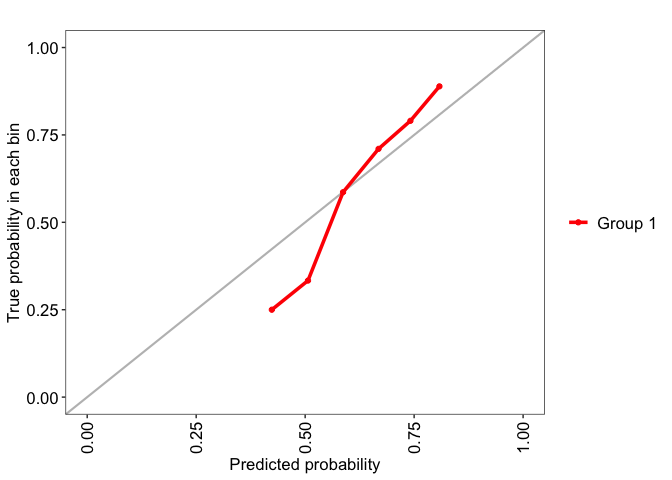
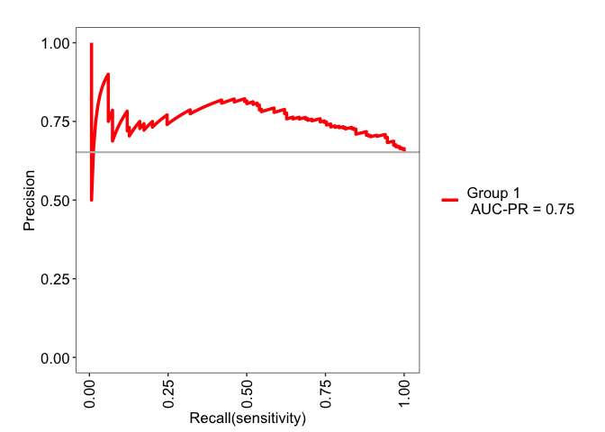
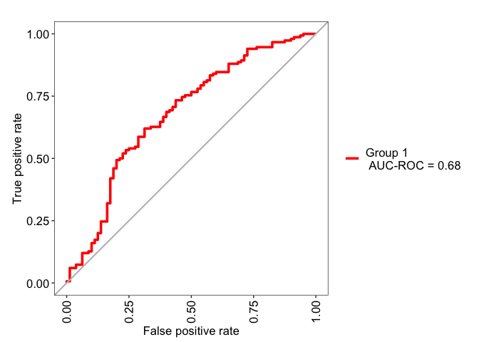

03- Random Forest Model 2 (Downselected Genes)
================

# Libraries

``` r
# Data cleaning
library(tidyverse)

# Parallelization
library(doParallel)

# Graphing packages
library(ggfortify)
library(ggplot2)
library(patchwork)
library(shapviz)
library(ComplexHeatmap)

# ML packages
library(survival)
library(caret)

# Model Evaluation
library(MLeval)
library(fastshap)
library(PRROC)

# DimReduction/Feature selection
library(FactoMineR)
library(factoextra)
library(WGCNA)
```

# Functions

``` r
pfun <- function(object, newdata) {
  predict(object, data = newdata)$predictions[, "Yes"]
}

prep_new_data <- function(gene_expr) {
  # indep_scale_gene_expr <- scale(gene_expr)
  gene_expr <- as.data.frame(t(gene_expr))
  frozen_mean_sd <- read.csv("./model/final_model_mean_sd.csv", row.names = 1) %>%
    t() %>%
    as.data.frame()
  gene_expr <- gene_expr[, colnames(frozen_mean_sd)]
  # scaled_gene_expr <- scale(gene_expr,
  #                           center = frozen_mean_sd['mean',],
  #                           scale = frozen_mean_sd['sd', ]) %>%
  #   as.data.frame()
  return(gene_expr)
}
```

``` r
plot_conf_mat <- function(test_pred, test_obs) {
  cm <- caret::confusionMatrix(test_pred, as.factor(test_obs))
  cm.tbl <- cm$table %>%
    as.tibble()
    
  p1 <- ggplot(cm.tbl, aes(fill = n, x = Reference, y = fct_rev(Prediction))) + 
    geom_tile() + 
    geom_text(aes(label = n)) + 
    scale_fill_gradient(low = 'grey90', high = 'salmon', name = "n_samples") +
    scale_x_discrete(expand = expansion(add = 0), name = "Truth") +
    scale_y_discrete(expand = expansion(add = 0), name = "Prediction") +
    theme_classic()
  return(p1)
}
```

``` r
# Built a function for this

## normDf should be genes (row names) x samples. Should be normalized, non-logged is fine, just use log = TRUE
## metaDf should have samples x data where row names are sampleIDs corresponding to the normDf column data
## colour.opt: str | column in metaDf to use for colouring the points
## log: bool | whether to log2(x+1) counts or not
## axes: numeric | vector of length 2 for the PCs to plot in x,y axes respectively
## label_samples: bool | whether or not to add text labels to the samples
## title: str | plot title
## return_data: bool | if TRUE, will return the PCA object from FactoMineR instead of a plot (default: FALSE)
PCA.plot <- function(normDf, 
                     metaDf,
                     colour.opt = NULL,
                     log = FALSE,
                     axes = 1:2,
                     label_samples = TRUE,
                     title = "PCA Score Plot",
                     return_data = FALSE
                     ) {
  if (log == TRUE) {
    mtx <- t(log2(normDf + 1)) %>% as.data.frame()
  } else {
    mtx <- t(normDf) %>% as.data.frame()
  }
  
  # Initial PCA
  res.pca <- PCA(mtx, scale.unit = TRUE, graph = FALSE)

  # Number of components to use
  nComp <- data.frame(res.pca$eig) %>% 
    filter(cumulative.percentage.of.variance < 95) %>% 
    nrow()

  # redo PCA with nComp
  res.pca <- PCA(mtx, ncp = nComp, graph = FALSE)

  # standard to view just the first 2 axes (more just to see whether the experimental design separates)
  score.df <- facto_summarize(res.pca,'ind', axes = axes)
  score.df <- merge(score.df, metaDf, by = 0)

  # pct variances
  comp.axes <- paste('comp', axes, sep = " ")
  dim.axes <- paste('Dim', axes, sep = ".")
  dim.x <- res.pca$eig[comp.axes[1], 'percentage of variance']
  dim.y <- res.pca$eig[comp.axes[2], 'percentage of variance']
  
  if (!is.null(colour.opt)) {
      p1 <- ggplot(score.df, 
                   aes(x = .data[[dim.axes[1]]], 
                       y = .data[[dim.axes[2]]], 
                       col = .data[[colour.opt]])) +
      geom_point(size = 3) +
      geom_hline(yintercept = 0, linetype = 'dashed') +
      geom_vline(xintercept = 0, linetype = 'dashed') +
      labs(title = title,
           x = sprintf("Dim %s (%#.2f%%)", axes[1], dim.x), 
           y = sprintf("Dim %s (%#.2f%%)", axes[2], dim.y)) +
      theme_bw() +
      theme(plot.title = element_text(hjust=0.5))
    } else {
      p1 <- ggplot(score.df, 
                   aes(x = .data[[dim.axes[1]]], 
                       y = .data[[dim.axes[2]]])) +
      geom_point(size = 3) +
      geom_hline(yintercept = 0, linetype = 'dashed') +
      geom_vline(xintercept = 0, linetype = 'dashed') +
      labs(title = title,
           x = sprintf("Dim %s (%#.2f%%)", axes[1], dim.x), 
           y = sprintf("Dim %s (%#.2f%%)", axes[2], dim.y)) +
      theme_bw() +
      theme(plot.title = element_text(hjust=0.5))
    }
  
  if (label_samples == TRUE) {
    p1 <- p1 +
      ggrepel::geom_text_repel(aes(label = name), size= 3)
  }
  if (return_data) {
    return(res.pca)
  } else {
    return(p1)
  }
}
```

``` r
wgcna_threshold_plot <- function(sft, yintercept = 0.6) {
  require("patchwork")
  scale.ind <- ggplot(sft$fitIndices) +
    geom_text(aes(x = Power, y = -sign(slope)*SFT.R.sq, label = Power), color = 'red') +
    geom_hline(yintercept = yintercept, color = "red") +
    labs(x = "Soft Threshold (power)",
         y = "Scale Free Topology Model Fit, signed R^2",
         title = "Scale independence") +
    theme_bw() +
    theme(plot.title = element_text(hjust = 0.5, face = "bold"))
  
  mean.k <- ggplot(sft$fitIndices,) +
  geom_text(aes(x = Power, y = mean.k., label = Power), color = "red") +
  labs(x = "Soft Threshold (power)",
       y = "Mean Connectivity",
       title = "Mean Connectivity") +
  theme_bw() +
  theme(plot.title = element_text(hjust = 0.5, face = "bold"))
  
  pwPlot <- scale.ind + mean.k + plot_layout(ncol = 2)
  return(pwPlot)
}
```

# Read Files

``` r
genes.inc <- readRDS('./model/uromol_train_criteria_genes.rds')
uromol.expr <- readRDS('./data_cleaned/expression/uromol_expression.rds')
uromol.clin <- readRDS('./data_cleaned/clinical/uromol_clinical_data.rds')

# training indices
cid <- readRDS('./model/uromol_train_test_indices.rds')
idx <- cid$train_test
cv_idx <- cid$cv

# training data + filter for genes to include
uromol.expr.train <- uromol.expr[idx, genes.inc]
uromol.clin.train <- uromol.clin[idx, ]
```

# RF model for downselected genes

Genes were selected based on:

1.  downselected ME genes
2.  DEG
3.  protein-coding
4.  found in microarray

``` r
ctrl <- trainControl(
  method = "cv",
  index = cv_idx,
  classProbs = TRUE,
  summaryFunction = twoClassSummary,
  allowParallel = TRUE,
  savePredictions = TRUE
)

rf_grid_downselect <- expand.grid(
  mtry = seq(1, 20, length.out = 5),
  splitrule = "gini",
  min.node.size = seq(10, 40, length.out = 5)
)

set.seed(1243)
rf.model2 <- caret::train(
  x = uromol.expr.train,
  y = uromol.clin.train$recurrence_at_36mths,
  preProcess = c("center", "scale"),
  method = "ranger",
  metric = "ROC",
  trControl = ctrl, # same control
  tuneGrid = rf_grid_downselect,
  num.trees = 1000,
  importance = "impurity_corrected"
)
```

# Evaluation

``` r
rf.bestModel2 <- rf.model2$finalModel
rf.model2.eval <- evalm(rf.model2)
```

    ## ***MLeval: Machine Learning Model Evaluation***

    ## Input: caret train function object

    ## Not averaging probs.

    ## Group 1 type: cv

    ## Observations: 230

    ## Number of groups: 1

    ## Observations per group: 230

    ## Positive: Yes

    ## Negative: No

    ## Group: Group 1

    ## Positive: 150

    ## Negative: 80

    ## ***Performance Metrics***

    ## Warning: Using `size` aesthetic for lines was deprecated in ggplot2 3.4.0.
    ## ℹ Please use `linewidth` instead.
    ## ℹ The deprecated feature was likely used in the MLeval package.
    ##   Please report the issue to the authors.
    ## This warning is displayed once per session.
    ## Call `lifecycle::last_lifecycle_warnings()` to see where this warning was
    ## generated.

<!-- --><!-- --><!-- --><!-- -->

    ## Group 1 Optimal Informedness = 0.3075

    ## Group 1 AUC-ROC = 0.68

``` r
ggsave("./plots/evaluation/uromol_RNAseq_criteria_genes_PRAUC_plot.pdf", 
       rf.model2.eval$proc,
       width = 5,
       height = 4)
```

## Feature Importance

``` r
registerDoParallel(cores = 6)  # use forking with 6 cores
rf.bestModel2.shap <- fastshap::explain(rf.bestModel2,
                                        X = uromol.expr.train, 
                                        pred_wrapper = pfun, 
                                        nsim = 100,
                                        adjust = TRUE,
                                        parallel = TRUE,
                                        shap_only = FALSE)

shap.model2.p1 <- sv_waterfall(shapviz(rf.bestModel2.shap), 
                        row_id = 1:nrow(rf.bestModel2.shap$feature_values)) +
  theme(margins = margin(1))
```

    ## Aggregating SHAP values over 230 observations

``` r
shap.model2.p2 <- sv_force(shapviz(rf.bestModel2.shap), 
                    row_id = 1:nrow(rf.bestModel2.shap$feature_values)) +
  theme(margins = margin(1))
```

    ## Aggregating SHAP values over 230 observations

``` r
shap.model2.p3 <- sv_importance(shapviz(rf.bestModel2.shap)) +
  labs(title = "SHAP Probability(Recurrence = Yes)") +
  scale_x_continuous(expand = expansion(add = c(0, 0.001))) +
  theme_classic() +
  theme(margins = margin(1))

ggsave("./plots/evaluation/uromol_RNAseq_criteria_genes_shap_plots.pdf",
       plot = shap.model2.p1 + 
         shap.model2.p2 + 
         shap.model2.p3 + 
         plot_layout(heights = c(2, 3,3), nrow = 3), 
       width = 6, height = 9)
```

``` r
rf.bestModel2.shap.summary <- colMeans(data.frame(abs(rf.bestModel2.shap$shapley_values), check.names = FALSE)) %>%
  data.frame(check.names = FALSE) %>%
  rename(mean_abs_SHAP = ".") %>%
  rownames_to_column("feature") %>%
  arrange(desc(mean_abs_SHAP)) %>%
  mutate(feature = factor(feature, levels = feature))

rf.bestModel2.shap.summary$cumu_importance <- cumsum(rf.bestModel2.shap.summary$mean_abs_SHAP)
rf.bestModel2.shap.summary$frac_cumu_importance <- rf.bestModel2.shap.summary$cumu_importance/sum(rf.bestModel2.shap.summary$mean_abs_SHAP)

keep.fraction <- 0.8

cumu.importance.model2.plot <- ggplot(rf.bestModel2.shap.summary, 
                                 aes(x = feature, y = frac_cumu_importance)) +
  geom_point(colour = 'salmon') +
  geom_hline(yintercept = keep.fraction, linetype = 'dashed') +
  geom_vline(xintercept = rf.bestModel2.shap.summary %>% 
               filter(frac_cumu_importance >= keep.fraction) %>% 
               pull(feature) %>% 
               head(1), linetype = 'dashed') +
  labs(y = "Cumulative feature importance proportion") +
  theme_classic() +
  theme(axis.text.x = element_text(angle = 90, hjust = 1, vjust = 0.5))
```

``` r
rf.bestModel2.features <- rf.bestModel2.shap.summary %>%
  filter(frac_cumu_importance <= keep.fraction) %>%
  pull(feature) %>%
  as.character()
```

``` r
saveRDS(rf.bestModel2.features, file = "./model/uromol_train_RF2_80pct_SHAP_genes.rds")
```
