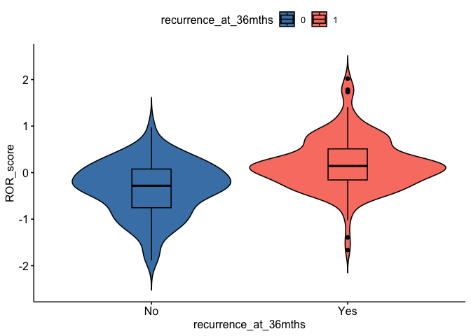
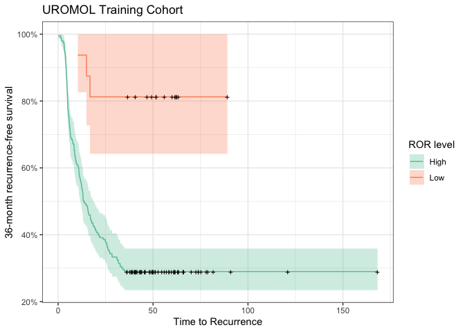
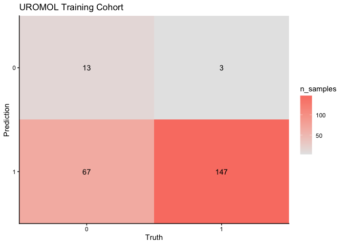
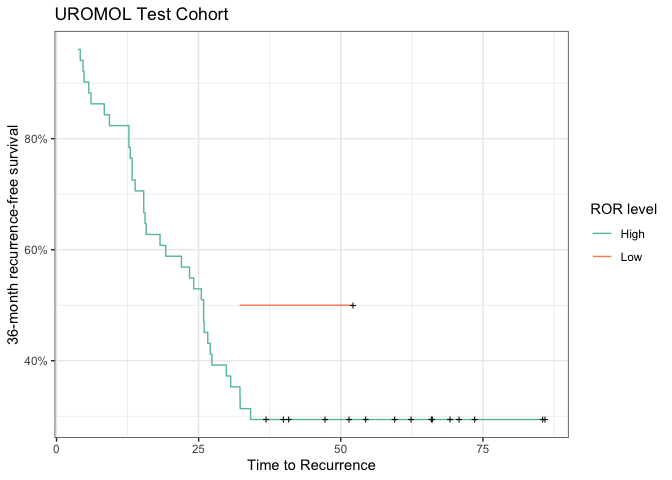
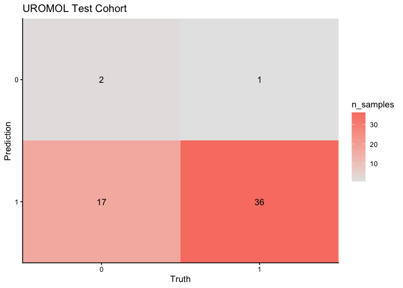
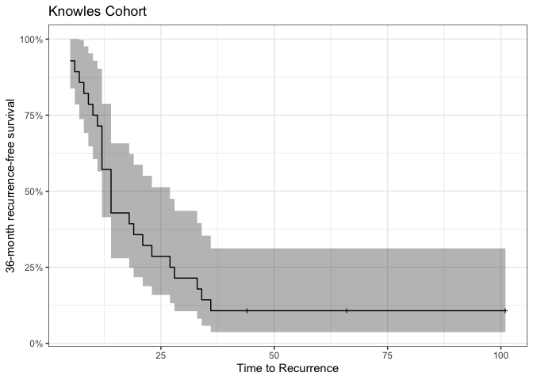
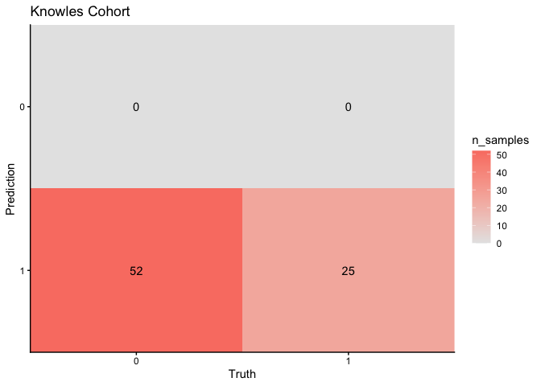
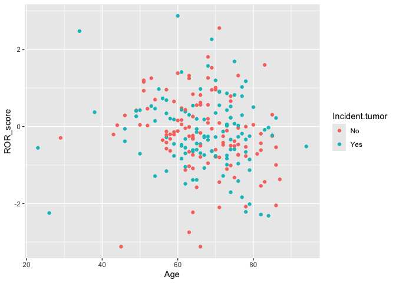

04- Final Cox Model-based Classifier
================

# Libraries

``` r
# Data cleaning
library(tidyverse)

# Parallelization
library(doParallel)

# Graphing packages
library(ggfortify)
library(ggplot2)
library(ggpubr)
library(patchwork)
library(shapviz)
library(ComplexHeatmap)

# ML packages
library(survival)
library(caret)

# Model Evaluation
library(MLeval)
library(fastshap)
library(PRROC)

# DimReduction/Feature selection
library(FactoMineR)
library(factoextra)
library(WGCNA)
```

# Functions

``` r
pfun <- function(object, newdata) {
  predict(object, data = newdata)$predictions[, "Yes"]
}

prep_new_data <- function(gene_expr) {
  # indep_scale_gene_expr <- scale(gene_expr)
  gene_expr <- as.data.frame(t(gene_expr))
  frozen_mean_sd <- read.csv("./model/final_model_mean_sd.csv", row.names = 1) %>%
    t() %>%
    as.data.frame()
  gene_expr <- gene_expr[, colnames(frozen_mean_sd)]
  # scaled_gene_expr <- scale(gene_expr,
  #                           center = frozen_mean_sd['mean',],
  #                           scale = frozen_mean_sd['sd', ]) %>%
  #   as.data.frame()
  return(gene_expr)
}
```

``` r
plot_conf_mat <- function(test_pred, test_obs) {
  cm <- caret::confusionMatrix(test_pred, as.factor(test_obs))
  cm.tbl <- cm$table %>%
    as.tibble()
    
  p1 <- ggplot(cm.tbl, aes(fill = n, x = Reference, y = fct_rev(Prediction))) + 
    geom_tile() + 
    geom_text(aes(label = n)) + 
    scale_fill_gradient(low = 'grey90', high = 'salmon', name = "n_samples") +
    scale_x_discrete(expand = expansion(add = 0), name = "Truth") +
    scale_y_discrete(expand = expansion(add = 0), name = "Prediction") +
    theme_classic()
  return(p1)
}
```

``` r
# Built a function for this

## normDf should be genes (row names) x samples. Should be normalized, non-logged is fine, just use log = TRUE
## metaDf should have samples x data where row names are sampleIDs corresponding to the normDf column data
## colour.opt: str | column in metaDf to use for colouring the points
## log: bool | whether to log2(x+1) counts or not
## axes: numeric | vector of length 2 for the PCs to plot in x,y axes respectively
## label_samples: bool | whether or not to add text labels to the samples
## title: str | plot title
## return_data: bool | if TRUE, will return the PCA object from FactoMineR instead of a plot (default: FALSE)
PCA.plot <- function(normDf, 
                     metaDf,
                     colour.opt = NULL,
                     log = FALSE,
                     axes = 1:2,
                     label_samples = TRUE,
                     title = "PCA Score Plot",
                     return_data = FALSE
                     ) {
  if (log == TRUE) {
    mtx <- t(log2(normDf + 1)) %>% as.data.frame()
  } else {
    mtx <- t(normDf) %>% as.data.frame()
  }
  
  # Initial PCA
  res.pca <- PCA(mtx, scale.unit = TRUE, graph = FALSE)

  # Number of components to use
  nComp <- data.frame(res.pca$eig) %>% 
    filter(cumulative.percentage.of.variance < 95) %>% 
    nrow()

  # redo PCA with nComp
  res.pca <- PCA(mtx, ncp = nComp, graph = FALSE)

  # standard to view just the first 2 axes (more just to see whether the experimental design separates)
  score.df <- facto_summarize(res.pca,'ind', axes = axes)
  score.df <- merge(score.df, metaDf, by = 0)

  # pct variances
  comp.axes <- paste('comp', axes, sep = " ")
  dim.axes <- paste('Dim', axes, sep = ".")
  dim.x <- res.pca$eig[comp.axes[1], 'percentage of variance']
  dim.y <- res.pca$eig[comp.axes[2], 'percentage of variance']
  
  if (!is.null(colour.opt)) {
      p1 <- ggplot(score.df, 
                   aes(x = .data[[dim.axes[1]]], 
                       y = .data[[dim.axes[2]]], 
                       col = .data[[colour.opt]])) +
      geom_point(size = 3) +
      geom_hline(yintercept = 0, linetype = 'dashed') +
      geom_vline(xintercept = 0, linetype = 'dashed') +
      labs(title = title,
           x = sprintf("Dim %s (%#.2f%%)", axes[1], dim.x), 
           y = sprintf("Dim %s (%#.2f%%)", axes[2], dim.y)) +
      theme_bw() +
      theme(plot.title = element_text(hjust=0.5))
    } else {
      p1 <- ggplot(score.df, 
                   aes(x = .data[[dim.axes[1]]], 
                       y = .data[[dim.axes[2]]])) +
      geom_point(size = 3) +
      geom_hline(yintercept = 0, linetype = 'dashed') +
      geom_vline(xintercept = 0, linetype = 'dashed') +
      labs(title = title,
           x = sprintf("Dim %s (%#.2f%%)", axes[1], dim.x), 
           y = sprintf("Dim %s (%#.2f%%)", axes[2], dim.y)) +
      theme_bw() +
      theme(plot.title = element_text(hjust=0.5))
    }
  
  if (label_samples == TRUE) {
    p1 <- p1 +
      ggrepel::geom_text_repel(aes(label = name), size= 3)
  }
  if (return_data) {
    return(res.pca)
  } else {
    return(p1)
  }
}
```

``` r
wgcna_threshold_plot <- function(sft, yintercept = 0.6) {
  require("patchwork")
  scale.ind <- ggplot(sft$fitIndices) +
    geom_text(aes(x = Power, y = -sign(slope)*SFT.R.sq, label = Power), color = 'red') +
    geom_hline(yintercept = yintercept, color = "red") +
    labs(x = "Soft Threshold (power)",
         y = "Scale Free Topology Model Fit, signed R^2",
         title = "Scale independence") +
    theme_bw() +
    theme(plot.title = element_text(hjust = 0.5, face = "bold"))
  
  mean.k <- ggplot(sft$fitIndices,) +
  geom_text(aes(x = Power, y = mean.k., label = Power), color = "red") +
  labs(x = "Soft Threshold (power)",
       y = "Mean Connectivity",
       title = "Mean Connectivity") +
  theme_bw() +
  theme(plot.title = element_text(hjust = 0.5, face = "bold"))
  
  pwPlot <- scale.ind + mean.k + plot_layout(ncol = 2)
  return(pwPlot)
}
```

# Read Files

``` r
g16 <- readRDS('./model/uromol_train_RF2_80pct_SHAP_genes.rds')
cid <- readRDS('./model/uromol_train_test_indices.rds')
idx <- cid$train_test
uromol.expr <- readRDS('./data_cleaned/expression/uromol_expression.rds')
knowles.expr <- readRDS('./data_cleaned/expression/knowles_expression.rds')

uromol.clin <- readRDS('./data_cleaned/clinical/uromol_clinical_data.rds')
knowles.clin <- readRDS('./data_cleaned/clinical/knowles_clinical_data.rds')


# split for train-test
# training data + filter for genes to include
uromol.expr.train <- uromol.expr[idx, g16]
uromol.clin.train <- uromol.clin[idx, ]

knowles.expr <- knowles.expr[rownames(knowles.clin), g16]
```

# Calculate ROR

- Idea is from PAM50 paper
  (<https://pmc.ncbi.nlm.nih.gov/articles/PMC2667820/#abstract1>)

- survival analysis with the selected genes

- sum of genes + coefficients as ROR

``` r
uromol.expr.train.scaled <- scale(uromol.expr.train) # this is the same as training in caret

uromol.train.coxph.df <- cbind(data.frame(uromol.expr.train.scaled, check.names = FALSE),
                               uromol.clin.train %>% select(RFS_time),
                               uromol.clin.train %>% select(recurrence_at_36mths)
                               ) %>%
  mutate(recurrence_at_36mths = case_match(recurrence_at_36mths,
                                           'Yes' ~ 1,
                                           'No' ~ 0)
         )
```

## Cox model

``` r
uromol.train.cox <- coxph(Surv(RFS_time, recurrence_at_36mths) ~ ., data=uromol.train.coxph.df)

#coefs
uromol.train.cox_coefs <- coef(uromol.train.cox)
```

``` r
saveRDS(uromol.train.cox_coefs, file = './model/ROR_model_coefs.rds')
```

## ROR scores

``` r
# convert to risk score (coef * scaled expr)
uromol.train.risk <- as.matrix(uromol.train.coxph.df[, g16]) %*% uromol.train.cox_coefs

uromol.train.coxph.df <- uromol.train.coxph.df %>%
  mutate(ROR_score = uromol.train.risk[,1])
```

# Threshold

``` r
# observe any differences in ROR scores
ggviolin(uromol.train.coxph.df,
         x = 'recurrence_at_36mths',
         y = 'ROR_score',
         add = 'boxplot', 
         fill = 'recurrence_at_36mths'
         ) +
  ggpubr::stat_compare_means(comparisons = list(c(0, 1)), 
                             method = "t.test", 
                             label = 'p.format'
                             ) +
  scale_fill_manual(values = c(`0` = 'steelblue', `1` = 'salmon')) +
  scale_x_discrete(labels = c('No', 'Yes'))
```

<!-- -->

``` r
# decide the threshold based on ROR
pr <- pr.curve(scores.class0 = uromol.train.coxph.df %>% filter(recurrence_at_36mths == 0) %>% pull(ROR_score),
               scores.class1 = uromol.train.coxph.df %>% filter(recurrence_at_36mths == 1) %>% pull(ROR_score),
               curve = TRUE
               )

pdf("./plots/evaluation/uromol_RNAseq_ROR_PRAUC.pdf", width = 5, height = 4)
plot(pr)
dev.off()
```

    ## quartz_off_screen 
    ##                 2

``` r
pr$curve # based on row 17: recall - 0.8500 precision - 0.31627907 threshold - -1.010441036
```

    ##          [,1]       [,2]         [,3]
    ##   [1,] 1.0000 0.34782609 -1.881313489
    ##   [2,] 1.0000 0.34782609 -1.881313489
    ##   [3,] 0.9875 0.34497817 -1.746627040
    ##   [4,] 0.9750 0.34210526 -1.665457063
    ##   [5,] 0.9625 0.33920705 -1.663727433
    ##   [6,] 0.9625 0.34070796 -1.394019132
    ##   [7,] 0.9625 0.34222222 -1.337080318
    ##   [8,] 0.9500 0.33928571 -1.298897144
    ##   [9,] 0.9375 0.33632287 -1.228009969
    ##  [10,] 0.9250 0.33333333 -1.192971362
    ##  [11,] 0.9125 0.33031674 -1.171440348
    ##  [12,] 0.9000 0.32727273 -1.097470568
    ##  [13,] 0.8875 0.32420091 -1.052522972
    ##  [14,] 0.8750 0.32110092 -1.042174774
    ##  [15,] 0.8625 0.31797235 -1.022433841
    ##  [16,] 0.8625 0.31944444 -1.014728363
    ##  [17,] 0.8500 0.31627907 -1.010441036
    ##  [18,] 0.8375 0.31308411 -0.911097940
    ##  [19,] 0.8250 0.30985915 -0.869031441
    ##  [20,] 0.8125 0.30660377 -0.861409353
    ##  [21,] 0.8000 0.30331754 -0.852876174
    ##  [22,] 0.7875 0.30000000 -0.787760524
    ##  [23,] 0.7750 0.29665072 -0.785188712
    ##  [24,] 0.7625 0.29326923 -0.785033618
    ##  [25,] 0.7500 0.28985507 -0.762758765
    ##  [26,] 0.7500 0.29126214 -0.760587277
    ##  [27,] 0.7500 0.29268293 -0.743546099
    ##  [28,] 0.7375 0.28921569 -0.705269374
    ##  [29,] 0.7250 0.28571429 -0.596720063
    ##  [30,] 0.7125 0.28217822 -0.588044711
    ##  [31,] 0.7125 0.28358209 -0.561764449
    ##  [32,] 0.7125 0.28500000 -0.546826058
    ##  [33,] 0.7000 0.28140704 -0.535260792
    ##  [34,] 0.6875 0.27777778 -0.534036590
    ##  [35,] 0.6750 0.27411168 -0.530151389
    ##  [36,] 0.6750 0.27551020 -0.519034733
    ##  [37,] 0.6750 0.27692308 -0.484224343
    ##  [38,] 0.6625 0.27319588 -0.469972631
    ##  [39,] 0.6625 0.27461140 -0.454749633
    ##  [40,] 0.6625 0.27604167 -0.454114010
    ##  [41,] 0.6625 0.27748691 -0.453589129
    ##  [42,] 0.6625 0.27894737 -0.450614356
    ##  [43,] 0.6625 0.28042328 -0.435479313
    ##  [44,] 0.6500 0.27659574 -0.433897259
    ##  [45,] 0.6500 0.27807487 -0.427229807
    ##  [46,] 0.6375 0.27419355 -0.424531987
    ##  [47,] 0.6375 0.27567568 -0.416818507
    ##  [48,] 0.6250 0.27173913 -0.412662960
    ##  [49,] 0.6250 0.27322404 -0.395517750
    ##  [50,] 0.6125 0.26923077 -0.391738616
    ##  [51,] 0.6125 0.27071823 -0.385436105
    ##  [52,] 0.6125 0.27222222 -0.381675676
    ##  [53,] 0.6000 0.26815642 -0.376126666
    ##  [54,] 0.5875 0.26404494 -0.367682589
    ##  [55,] 0.5875 0.26553672 -0.362692308
    ##  [56,] 0.5875 0.26704545 -0.362403107
    ##  [57,] 0.5750 0.26285714 -0.358252034
    ##  [58,] 0.5625 0.25862069 -0.334449432
    ##  [59,] 0.5625 0.26011561 -0.328863043
    ##  [60,] 0.5625 0.26162791 -0.319532077
    ##  [61,] 0.5500 0.25730994 -0.316167074
    ##  [62,] 0.5500 0.25882353 -0.315087606
    ##  [63,] 0.5500 0.26035503 -0.311953053
    ##  [64,] 0.5375 0.25595238 -0.310091086
    ##  [65,] 0.5375 0.25748503 -0.305167289
    ##  [66,] 0.5250 0.25301205 -0.301110404
    ##  [67,] 0.5250 0.25454545 -0.291981960
    ##  [68,] 0.5125 0.25000000 -0.287051554
    ##  [69,] 0.5000 0.24539877 -0.280779769
    ##  [70,] 0.5000 0.24691358 -0.276875015
    ##  [71,] 0.4875 0.24223602 -0.270161318
    ##  [72,] 0.4875 0.24375000 -0.269751331
    ##  [73,] 0.4750 0.23899371 -0.267591460
    ##  [74,] 0.4625 0.23417722 -0.265588863
    ##  [75,] 0.4500 0.22929936 -0.263740039
    ##  [76,] 0.4500 0.23076923 -0.247193717
    ##  [77,] 0.4500 0.23225806 -0.218327421
    ##  [78,] 0.4500 0.23376623 -0.215677325
    ##  [79,] 0.4500 0.23529412 -0.206452746
    ##  [80,] 0.4500 0.23684211 -0.199378751
    ##  [81,] 0.4375 0.23178808 -0.182790412
    ##  [82,] 0.4375 0.23333333 -0.175505399
    ##  [83,] 0.4250 0.22818792 -0.175495605
    ##  [84,] 0.4125 0.22297297 -0.168126742
    ##  [85,] 0.4125 0.22448980 -0.158771189
    ##  [86,] 0.4125 0.22602740 -0.157725413
    ##  [87,] 0.4125 0.22758621 -0.156747038
    ##  [88,] 0.4125 0.22916667 -0.147341196
    ##  [89,] 0.4000 0.22377622 -0.146152583
    ##  [90,] 0.4000 0.22535211 -0.145310987
    ##  [91,] 0.3875 0.21985816 -0.141123422
    ##  [92,] 0.3875 0.22142857 -0.122483340
    ##  [93,] 0.3750 0.21582734 -0.120505098
    ##  [94,] 0.3750 0.21739130 -0.107012752
    ##  [95,] 0.3750 0.21897810 -0.100918441
    ##  [96,] 0.3750 0.22058824 -0.100157299
    ##  [97,] 0.3750 0.22222222 -0.098247524
    ##  [98,] 0.3625 0.21641791 -0.089277945
    ##  [99,] 0.3625 0.21804511 -0.088872789
    ## [100,] 0.3625 0.21969697 -0.080110649
    ## [101,] 0.3500 0.21374046 -0.080016272
    ## [102,] 0.3500 0.21538462 -0.062021012
    ## [103,] 0.3375 0.20930233 -0.056573496
    ## [104,] 0.3375 0.21093750 -0.043315878
    ## [105,] 0.3250 0.20472441 -0.035657718
    ## [106,] 0.3125 0.19841270 -0.034361716
    ## [107,] 0.3000 0.19200000 -0.033945285
    ## [108,] 0.3000 0.19354839 -0.033099566
    ## [109,] 0.3000 0.19512195 -0.021628263
    ## [110,] 0.3000 0.19672131 -0.012484071
    ## [111,] 0.3000 0.19834711 -0.005907622
    ## [112,] 0.3000 0.20000000  0.005729455
    ## [113,] 0.2875 0.19327731  0.015040814
    ## [114,] 0.2875 0.19491525  0.016577380
    ## [115,] 0.2875 0.19658120  0.021711218
    ## [116,] 0.2750 0.18965517  0.023478092
    ## [117,] 0.2750 0.19130435  0.029474135
    ## [118,] 0.2750 0.19298246  0.034401705
    ## [119,] 0.2750 0.19469027  0.041218757
    ## [120,] 0.2750 0.19642857  0.043755237
    ## [121,] 0.2750 0.19819820  0.048288569
    ## [122,] 0.2750 0.20000000  0.049040181
    ## [123,] 0.2750 0.20183486  0.052224287
    ## [124,] 0.2750 0.20370370  0.054161392
    ## [125,] 0.2750 0.20560748  0.057567401
    ## [126,] 0.2750 0.20754717  0.059713676
    ## [127,] 0.2750 0.20952381  0.064716386
    ## [128,] 0.2750 0.21153846  0.073606131
    ## [129,] 0.2625 0.20388350  0.074727713
    ## [130,] 0.2500 0.19607843  0.082091700
    ## [131,] 0.2375 0.18811881  0.085616806
    ## [132,] 0.2375 0.19000000  0.089073820
    ## [133,] 0.2375 0.19191919  0.100793070
    ## [134,] 0.2375 0.19387755  0.105936056
    ## [135,] 0.2250 0.18556701  0.112508161
    ## [136,] 0.2250 0.18750000  0.132801682
    ## [137,] 0.2250 0.18947368  0.135353958
    ## [138,] 0.2250 0.19148936  0.136395457
    ## [139,] 0.2125 0.18279570  0.137165175
    ## [140,] 0.2125 0.18478261  0.138207451
    ## [141,] 0.2000 0.17582418  0.148145266
    ## [142,] 0.2000 0.17777778  0.148197443
    ## [143,] 0.2000 0.17977528  0.153329785
    ## [144,] 0.2000 0.18181818  0.156948836
    ## [145,] 0.2000 0.18390805  0.158149665
    ## [146,] 0.1875 0.17441860  0.159729751
    ## [147,] 0.1875 0.17647059  0.161953385
    ## [148,] 0.1750 0.16666667  0.165656892
    ## [149,] 0.1625 0.15662651  0.175603634
    ## [150,] 0.1625 0.15853659  0.178857905
    ## [151,] 0.1625 0.16049383  0.184890299
    ## [152,] 0.1625 0.16250000  0.191951707
    ## [153,] 0.1625 0.16455696  0.192562813
    ## [154,] 0.1625 0.16666667  0.193869992
    ## [155,] 0.1625 0.16883117  0.195378196
    ## [156,] 0.1625 0.17105263  0.198955197
    ## [157,] 0.1625 0.17333333  0.200373638
    ## [158,] 0.1500 0.16216216  0.202002990
    ## [159,] 0.1500 0.16438356  0.206788997
    ## [160,] 0.1500 0.16666667  0.211962080
    ## [161,] 0.1375 0.15492958  0.214656287
    ## [162,] 0.1375 0.15714286  0.224095488
    ## [163,] 0.1375 0.15942029  0.240337236
    ## [164,] 0.1250 0.14705882  0.243441177
    ## [165,] 0.1250 0.14925373  0.248802184
    ## [166,] 0.1250 0.15151515  0.250011679
    ## [167,] 0.1250 0.15384615  0.265580926
    ## [168,] 0.1250 0.15625000  0.266826191
    ## [169,] 0.1250 0.15873016  0.267302038
    ## [170,] 0.1250 0.16129032  0.270373598
    ## [171,] 0.1250 0.16393443  0.273335793
    ## [172,] 0.1250 0.16666667  0.273895191
    ## [173,] 0.1250 0.16949153  0.281069129
    ## [174,] 0.1250 0.17241379  0.284247774
    ## [175,] 0.1250 0.17543860  0.320235049
    ## [176,] 0.1250 0.17857143  0.326352566
    ## [177,] 0.1125 0.16363636  0.339576063
    ## [178,] 0.1000 0.14814815  0.341338027
    ## [179,] 0.1000 0.15094340  0.342197429
    ## [180,] 0.0875 0.13461538  0.346306114
    ## [181,] 0.0875 0.13725490  0.365049891
    ## [182,] 0.0875 0.14000000  0.365508757
    ## [183,] 0.0750 0.12244898  0.388993075
    ## [184,] 0.0750 0.12500000  0.405546886
    ## [185,] 0.0625 0.10638298  0.419320694
    ## [186,] 0.0625 0.10869565  0.431217210
    ## [187,] 0.0500 0.08888889  0.434107183
    ## [188,] 0.0500 0.09090909  0.468831201
    ## [189,] 0.0500 0.09302326  0.479733045
    ## [190,] 0.0500 0.09523810  0.481717262
    ## [191,] 0.0375 0.07317073  0.519609813
    ## [192,] 0.0375 0.07500000  0.543117156
    ## [193,] 0.0375 0.07692308  0.547772846
    ## [194,] 0.0375 0.07894737  0.553488563
    ## [195,] 0.0375 0.08108108  0.557356514
    ## [196,] 0.0375 0.08333333  0.577540282
    ## [197,] 0.0375 0.08571429  0.583449626
    ## [198,] 0.0250 0.05882353  0.599829803
    ## [199,] 0.0125 0.03030303  0.603916096
    ## [200,] 0.0125 0.03125000  0.614527557
    ## [201,] 0.0125 0.03225806  0.622071646
    ## [202,] 0.0125 0.03333333  0.635590276
    ## [203,] 0.0125 0.03448276  0.695016008
    ## [204,] 0.0125 0.03571429  0.708304863
    ## [205,] 0.0125 0.03703704  0.725308903
    ## [206,] 0.0125 0.03846154  0.726498147
    ## [207,] 0.0125 0.04000000  0.757442529
    ## [208,] 0.0125 0.04166667  0.759837452
    ## [209,] 0.0125 0.04347826  0.764789386
    ## [210,] 0.0125 0.04545455  0.779639492
    ## [211,] 0.0125 0.04761905  0.812231130
    ## [212,] 0.0125 0.05000000  0.826588428
    ## [213,] 0.0125 0.05263158  0.831416632
    ## [214,] 0.0125 0.05555556  0.837228571
    ## [215,] 0.0125 0.05882353  0.855329881
    ## [216,] 0.0125 0.06250000  0.884063801
    ## [217,] 0.0125 0.06666667  0.899872230
    ## [218,] 0.0125 0.07142857  0.906202242
    ## [219,] 0.0125 0.07692308  0.908019978
    ## [220,] 0.0125 0.08333333  0.918229930
    ## [221,] 0.0125 0.09090909  0.921543899
    ## [222,] 0.0125 0.10000000  0.971988709
    ## [223,] 0.0000 0.00000000  1.113642711
    ## [224,] 0.0000 0.00000000  1.141015199
    ## [225,] 0.0000 0.00000000  1.158421547
    ## [226,] 0.0000 0.00000000  1.215538695
    ## [227,] 0.0000 0.00000000  1.408040050
    ## [228,] 0.0000 0.00000000  1.731769437
    ## [229,] 0.0000 0.00000000  1.758284718
    ## [230,] 0.0000 0.00000000  1.780861350
    ## [231,] 0.0000 0.00000000  2.017695181
    ## [232,] 0.0000 0.00000000  2.017695181

``` r
uromol.train.coxph.df <- uromol.train.coxph.df %>%
  mutate(ROR_level = case_when(ROR_score > -1.01 ~ "High",
                               ROR_score <= -1.01 ~ "Low"))
```

``` r
km.ROR.fit <- survfit(Surv(RFS_time, event = recurrence_at_36mths) ~ ROR_level, 
                      data=uromol.train.coxph.df)

ROR.kmplot <- autoplot(km.ROR.fit, 
                       main = "UROMOL Training Cohort",
                       xlab = "Time to Recurrence",
                       ylab = "36-month recurrence-free survival") +
  scale_colour_discrete(palette = "Set2", name = "ROR level") +
  scale_fill_discrete(palette = "Set2", name = "ROR level") +
  theme_bw()

ROR.kmplot
```

<!-- -->

``` r
ggsave("./plots/evaluation/km_survival_ROR_stratified_uromol_train.pdf", ROR.kmplot, width = 6, height = 4)
```

``` r
uromol.train.conf_mat_df <- uromol.train.coxph.df %>%
    mutate(pred_recurrence_36mths = case_match(ROR_level,
                                               "High" ~ 1,
                                               "Low" ~ 0),
           pred_recurrence_36mths = factor(pred_recurrence_36mths, levels = c(0,1)),
           recurrence_at_36mths_binary = factor(recurrence_at_36mths, levels = c(0,1)
                                                )
           )

uromol.train.ror.conf_mtx <- plot_conf_mat(uromol.train.conf_mat_df$pred_recurrence_36mths,
                              uromol.train.conf_mat_df$recurrence_at_36mths_binary) +
  labs(title = "UROMOL Training Cohort")

uromol.train.ror.conf_mtx
```

<!-- -->

``` r
ggsave("./plots/evaluation/confusion_matrix_ROR_stratified_uromol.train.pdf",
       uromol.train.ror.conf_mtx,
       width = 5,
       height = 4)
```

# Evaluate on test

``` r
train.means <- colMeans(uromol.expr.train)
train.sd <- apply(uromol.expr.train, 2, sd)
```

``` r
evaluate.ROR <- function(expr.data,
                         metadata,
                         geneset, 
                         plot.title = "Training",
                         conf.int = TRUE) {
  comb.df <- merge(expr.data[, geneset], metadata, by = 0)
  cox_coefs <- readRDS('./model/ROR_model_coefs.rds')
  # convert to risk score (coef * scaled expr)
  risk <- as.matrix(comb.df[, geneset]) %*% cox_coefs
  
  cox.df <- comb.df %>%
    mutate(ROR_score = risk[,1],
           ROR_level = case_when(ROR_score > -1.01 ~ "High",
                               ROR_score <= -1.01 ~ "Low"),
           pred_recurrence_36mths = case_match(ROR_level,
                                               "High" ~ 1,
                                               "Low" ~ 0),
           recurrence_at_36mths_binary = case_match(recurrence_at_36mths,
                                             "Yes" ~ 1,
                                             "No" ~ 0)
           )
  
  km.ROR.fit <- survfit(Surv(RFS_time, event = recurrence_at_36mths_binary) ~ ROR_level,
                      data=cox.df)
  
  ROR.kmplot <- autoplot(km.ROR.fit,
                         main = plot.title,
                         xlab = "Time to Recurrence",
                         ylab = "36-month recurrence-free survival",
                         conf.int = conf.int
                         ) +
    scale_colour_manual(values = c("High" = "#66C2A5",
                                   "Low" = "#FC8D62"), name = "ROR level") +
    scale_fill_manual(values = c("High" = "#66C2A5",
                                   "Low" = "#FC8D62"), name = "ROR level") +
    theme_bw()

  conf_mat_df <- cox.df %>%
    mutate(pred_recurrence_36mths = factor(pred_recurrence_36mths, levels = c(0,1)),
           recurrence_at_36mths_binary = factor(recurrence_at_36mths_binary, levels = c(0,1)
                                                )
           )
  ror.conf_mtx <- plot_conf_mat(conf_mat_df$pred_recurrence_36mths,
                                conf_mat_df$recurrence_at_36mths_binary) +
  labs(title = plot.title)
  return(list(km = ROR.kmplot, 
              conf.mtx = ror.conf_mtx, 
              cox.df = conf_mat_df))
}
```

``` r
uromol.expr.test <- scale(uromol.expr[-idx, g16], center = train.means, scale = train.sd)
uromol.clin.test <- uromol.clin[-idx, ]

uromol.test.ROR.plots <- evaluate.ROR(uromol.expr.test,
                                     metadata = uromol.clin.test,
                                     geneset = g16,
                                     plot.title = "UROMOL Test Cohort",
                                     conf.int = FALSE)

uromol.test.ROR.plots$km
```

<!-- -->

``` r
uromol.test.ROR.plots$conf.mtx
```

<!-- -->

``` r
# confidence interval can't be plotted because the n is too small
ggsave("./plots/evaluation/km_survival_ROR_stratified_uromol_test.pdf",
       uromol.test.ROR.plots$km,
       width = 6,
       height = 4
       )

ggsave("./plots/evaluation/confusion_matrix_ROR_stratified_uromol_test.pdf",
       uromol.test.ROR.plots$conf.mtx,
       width = 5,
       height = 4
       )
```

# Evaluate on knowles

``` r
knowles.expr.scaled <- scale(knowles.expr[,g16], center = train.means, scale = train.sd)

knowles.ROR.plots <- evaluate.ROR(knowles.expr.scaled,
                                  metadata = knowles.clin,
                                  geneset = g16,
                                  plot.title = "Knowles Cohort",
                                  conf.int = TRUE)

knowles.ROR.plots$km
```

<!-- -->

``` r
knowles.ROR.plots$conf.mtx
```

<!-- -->

``` r
ggsave("./plots/evaluation/km_survival_ROR_stratified_knowles.pdf",
       knowles.ROR.plots$km,
       width = 6,
       height = 4
       )

ggsave("./plots/evaluation/confusion_matrix_ROR_stratified_knowles.pdf",
       knowles.ROR.plots$conf.mtx,
       width = 5,
       height = 4
       )
```

# Correlate ROR with age

``` r
comb.df <- merge(uromol.expr.train[, g16], uromol.clin.train, by = 0)
cox_coefs <- readRDS('./model/ROR_model_coefs.rds')
# convert to risk score (coef * scaled expr)
risk.train <- as.matrix(comb.df[, g16]) %*% cox_coefs
```

``` r
comb.df %>%
  mutate(ROR_score = risk.train[,1]) %>%
  ggplot(aes(x = Age, y = ROR_score, color = Incident.tumor)) +
  geom_point()
```

<!-- -->
